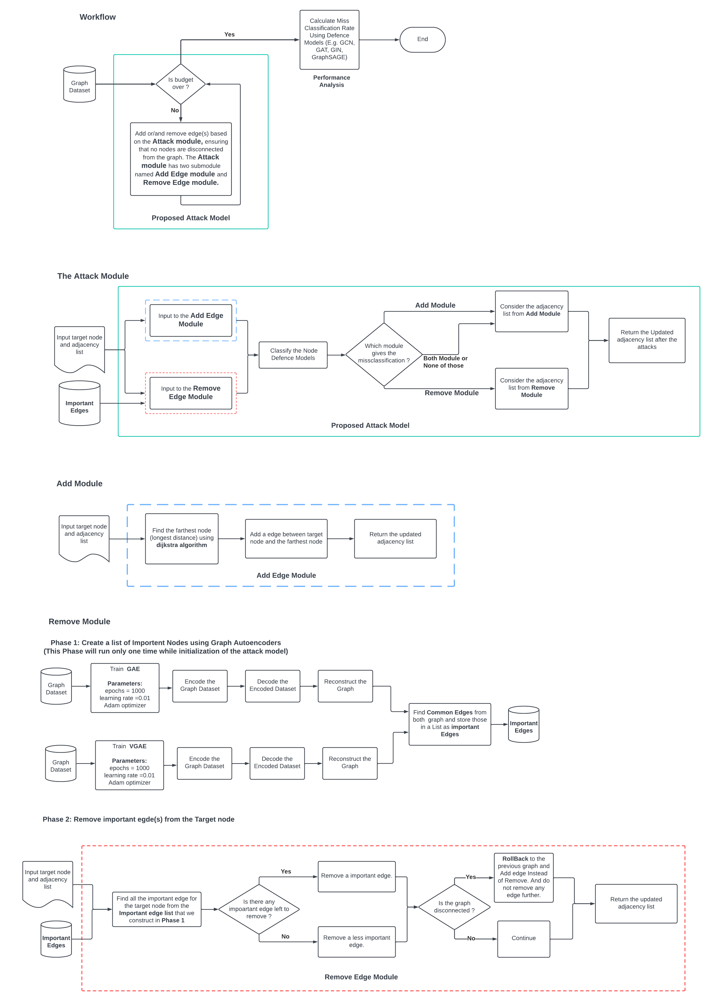

# Graph Attack

Graph Attack is a Python project that implements a proposed attack model on graph data. 

## Table of Contents

- [Introduction](#introduction)
- [Features](#features)
- [Installation](#installation)
- [Usage](#usage)
- [Flowchart](#flowchart)


## Introduction

A targeted attack on Node classification on Graph Dataset.

## Features

The attack have two module.

- Add edge module
- Remove edge module

## Installation

1. **Python Version**: This project requires Python **3.8.0**. If you don't have it installed, you can download it from [Python's official website](https://www.python.org/downloads/release/python-380/).
2. Create a virtual environment using the following command:
   ```bash
    py -3.8 -m venv venv2
   ```
3. Check the appropriate CUDA version if you have nvidia GPU:
   ```bash
   pip install -r requirements.txt
   ```
   
5. **Dependencies**: Install the project dependencies by running the following command:

   ```bash
   nvidia-smi
   ```
   
   
## Usage
   ```bash
   python proposed_attack_model.py
   ```

## Flowchart

Check out the flowchart PDF in the [flowchart folder](./flowchart/).

[](./flowchart/Graph_Attack_Module.pdf)


