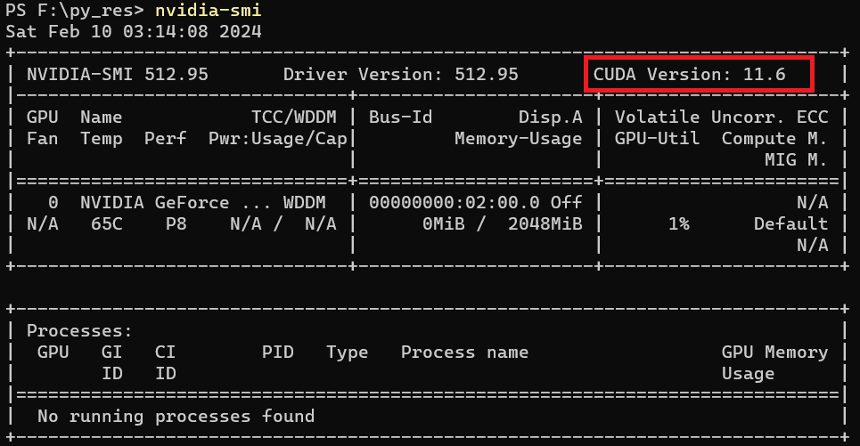
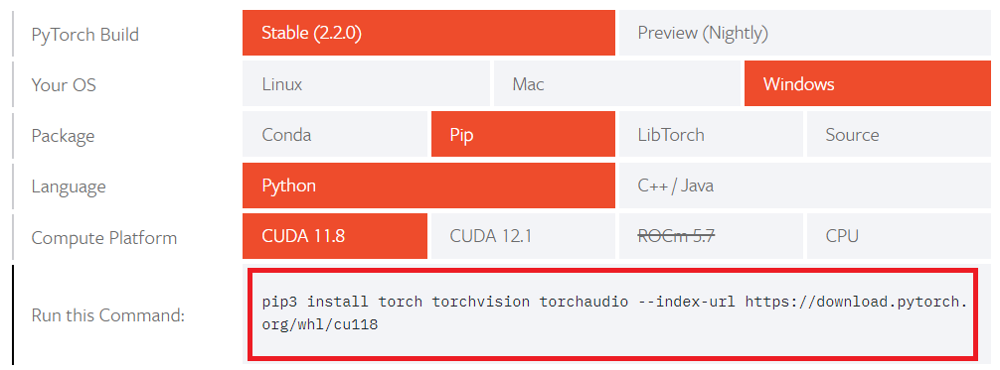

# Graph Attack

Graph Attack is a Python project that implements a proposed attack model on graph data. 

## Table of Contents

- [Introduction](#introduction)
- [Features](#features)
- [Installation](#installation)
- [Usage](#usage)
- [Flowchart](#flowchart)


## Introduction

A targeted attack on Node classification on Graph Dataset.

## Features

The attack have two module.

- Add edge module
- Remove edge module

## Installation

1. **Python Version**: This project requires Python **3.8.0**. If you don't have it installed, you can download it from [Python's official website](https://www.python.org/downloads/release/python-380/).
2. Create a virtual environment using the following command:
   ```bash
    py -3.8 -m venv attack_venv
   ```
   or,
   ```bash
    conda create -n attack_venv python=3.8
   ```
4. Check the appropriate CUDA version if you have nvidia GPU:
   ```bash
   nvidia-smi
   ```
   [](./images/nvidia_smi.png)
5. Select the appropriate PyTorch version from [PyTorch's official website](https://pytorch.org/get-started/locally/).
   [](./images/pytorch_get_started.png)
6. Install the PyTorch separately using the selected command:
   ```bash
   pip install torch torchvision torchaudio --index-url https://download.pytorch.org/whl/cu118
   ```
7. **Dependencies**: Install rest of the project dependencies by running the following command:
   ```bash
   pip install -r requirements.txt
   ```
   
## Usage
1. Activate the virtual environment.
2. To perform the **proposed attack**, run the following command:
   ```bash
    python proposed_attack_model.py
   ```
3. To perform a single **state of the art** attack, use **state_of_the_art_attack_models.py** script and edit accordingly.
    ```bash
    python state_of_the_art_attack_models.py
   ```
4. To perform **all the attacks**, run the following command:
   ```bash
    python perform_all_attacks.py
   ```
   or,
   ```bash
    python perform_all_attacks.py --dataset citeseer --defense_model mdgcn
   ```

## Flowchart

Check out the flowchart PDF in the [flowchart folder](./flowchart/).

[](./flowchart/Graph_Attack_Module.pdf)


